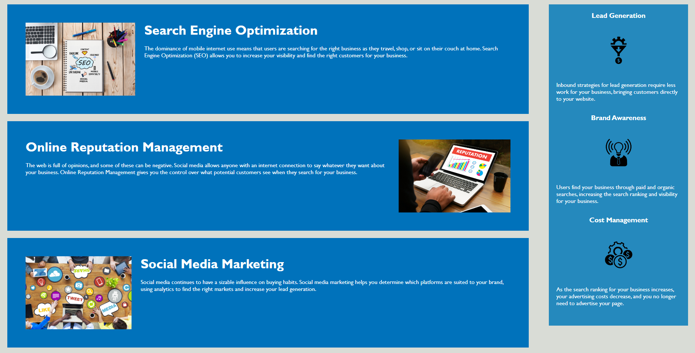

# Horiseon Refactor

## Description

This repository has code that refactors the original Horiseaon webpage to be more accesible. To achieve accesibility, multiple modifications where made: adoption of semantic elements, 
addition of alt atributes to images, and removal of redundant classes. The end product is a webpage that hadn't changed in appearance but is more accesible. 

This project is my first application of basic HTML and CSS knowledge. It serves as a benchmark that represents my understanding of multiple html tags and attributes as well as my ability to understand existing company code and to refactor it to meet certain set of standards. 

## Specific Changes Made

Changes made include:
- Switching div tags to appropriate semantic tags
    - Use of header, nav, main, article, asside, and footer tags
- Modifying style sheet "style.css" to use new semantic sections
- Removing old classes that are now unused
- Fixing navigation anchors to properly link to correct sections
- Adding alt attributes to images for cases where images fail to load

## Deployed Site

### Deployed Site Link
[Refactored Horiseon Site](https://hmanjun.github.io/horiseon-refactor/)

## License
[Link](https://github.com/hmanjun/horiseon-refactor/blob/main/LICENSE)

